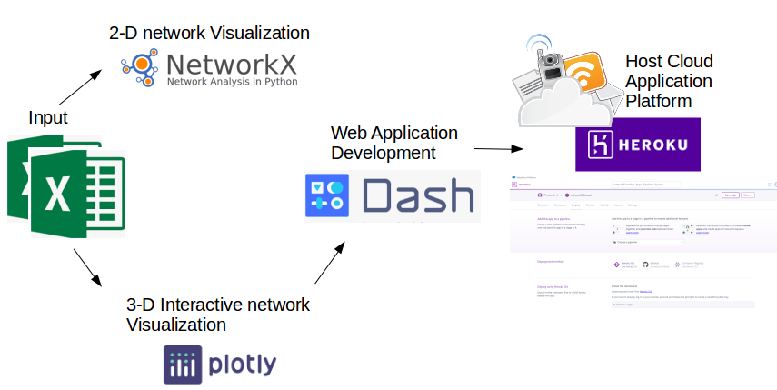
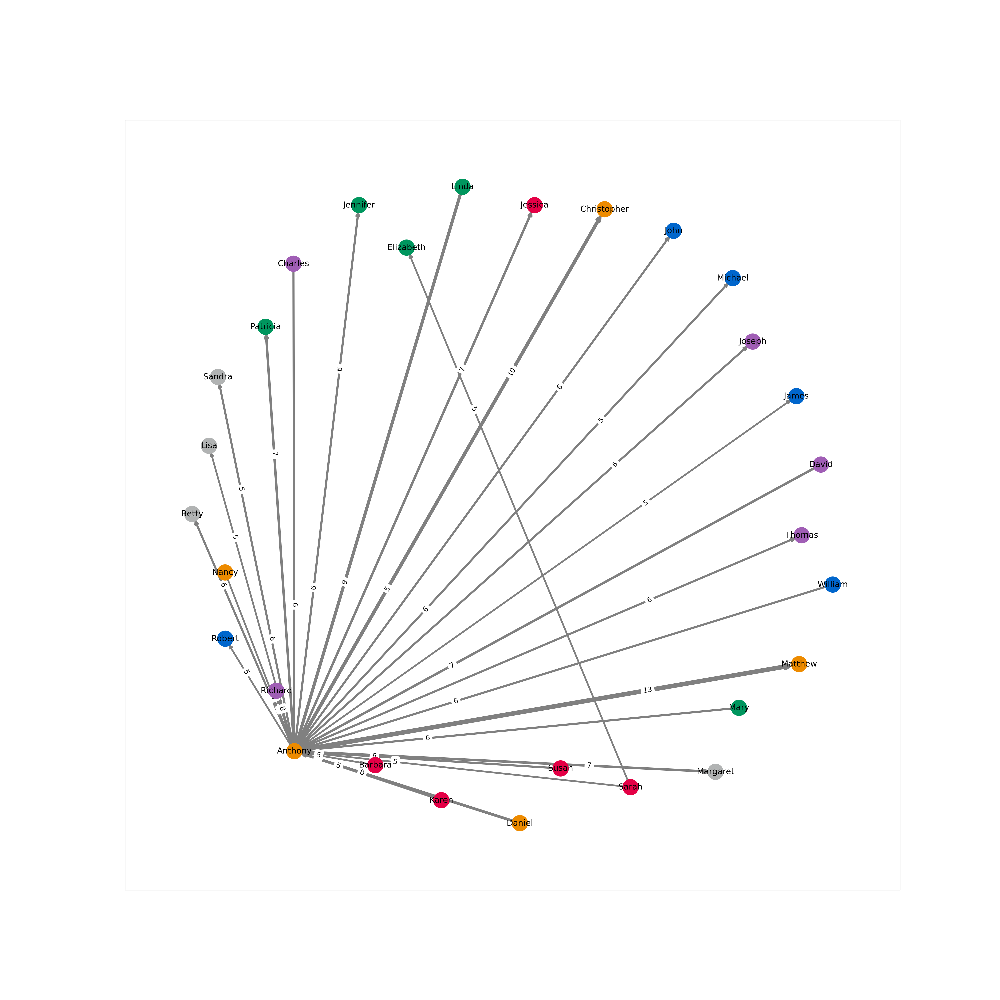
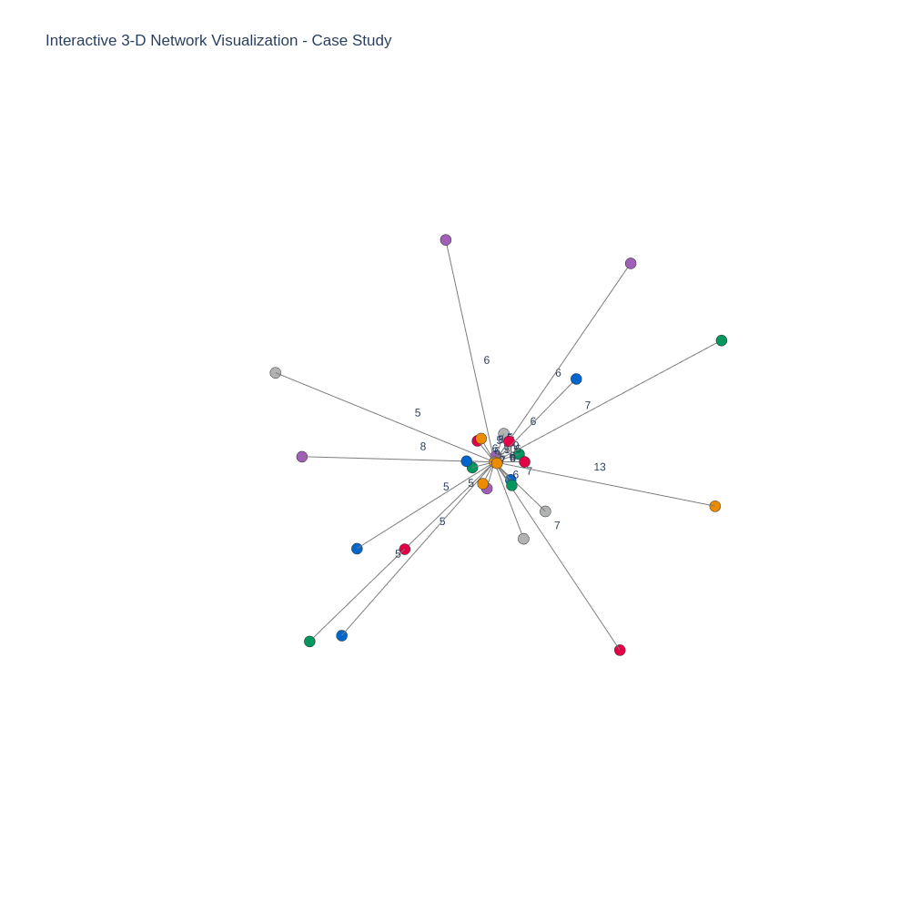

# RAAN-Case-Study

## Interactive network 2-D and 3-D visualizations with NetworkX, Plotly, Dash and Heroku

This project includes the 2D and 3D Visualizations of a network archichecture, utilizing networkX and plotly libraries as well as the creation of a web application via Dash and its deployment via Heroku.

[NetworkX](https://networkx.org/) constitutes a Python package, which aims to the devision, handling and evaluation of complex networks with respect to their structure, dynamics and functionality. 

[Plotly](https://plotly.com/) library consists of an interactive, open-source plotting library, which offers chart types for diverse statistical, financial, geographic, scientific, and 3-dimensional use-cases.

[Dash](https://dash.plotly.com/introduction#:~:text=Dash%20is%20a%20productive%20Python,works%20with%20data%20in%20Python.) framework, implemented on top of Flask, Plotly.js, and React.js, enables the development of highly customable analytic web applications using various programming languages (Python, R, and Julia), without the need for JavaScript and DevOps.

[Heroku](https://www.heroku.com/what), being a container-based cloud Platform, permit developers to deploy, manage, and scale modern apps.

The project pipeline can be summarized below:

## Installation instructions

The application requires python installation via [Anaconda distribution](https://docs.anaconda.com/anaconda/install/) and is tested in Ubuntu 16.04 LTS.

For running the application locally, please run :

1. Clone the repository : \
    _git clone git@github.com:iliana-pap/RAAN-Case-Study.git_
3. _cd RAAN-Case-Study_
4. Copy paste the data input file (raan_case_study interns.xlsx) into the directory
5. Run _source Setup.sh_ for sourcing the script to run in the interactive session of the bash script

Alternatively, you can execute the following steps :

1. Clone the repository : \
    _git clone git@github.com:iliana-pap/RAAN-Case-Study.git_
3. _cd RAAN-Case-Study_
4. Copy paste the data input file (raan_case_study interns.xlsx) into the directory
5. Create a new conda environment : \
   _conda create --name network_visual_env python=3.7.3_
5. Activate the conda environment :\
   _conda activate network_visual_env_
6. Install the following package requirements : \
   _pip install plotly==4.14.3_ \
   _pip install dash==1.20.0_ \
   _pip install networkx==2.5.1_ \
   _pip install pandas==1.2.4_ \
   _pip install xlrd==2.0.1_ \
   _pip install openpyxl==3.0.7_ \
   _pip install matplotlib==3.4.1_\
   **_pip install gunicorn==20.1.0_** *
 7. Run the application locally : \
    _python app.py_
   
  ***gunicorn package is important for running Heroku**
  
 ## Deploy the application into Heroku
 
 For deploying the web application into Heroku, the following steps have been performed:
 1. Create an account on Heroku (if non existent)
 2. Create the app name, which is included in the URL (network3dvisual in this case)
 3. Download and install Heroku CLI, which enables the devision and the control of Heroku applications directly via the terminal
 4. In the application file (app.py) under command app = dash.Dash(__name__) add command server = app.
 5. Being in the activated conda environment in the project directory, create .gitignore file for aiding Heroku to ignore some files of the project
 6. Create Procfile file and add command web: gunicorn app:server
 7. Devise requirements.txt via running :
   _pip freeze > requirements.txt_
   
 8. Login into Heroku : \
    _heroku login_
 9. Associate your local git repository with the remote heroku repository : \
    _heroku git: remote -a network3dvisual_
 10. Add all files and commit changes : \
     _git add ._ \
     _git commit -m "commit changes"_ 
  11. Push changes to Heroku : \
     _git push heroku main_ (I pushed an existing git repository into Heroku, otherwise run _git push heroku master_ for a new created git repository)

For updating the application on Heroku, follow the following steps:
1. _heroku login_
2. Utilize Git to clone network3dvisual's source code to your local machine : \
  _heroku git:clone -a network3dvisual_ \
 _cd network3dvisual_
3. Deploy new alterations : \
    _git add ._ \
    _git commit -m "commit changes"_ 
4.  Push changes to Heroku : \
     _git push heroku main_

  

## Visualization assumptions:

NetworkX library utilize the [Fruchterman Reingold layout](https://github.com/gephi/gephi/wiki/Fruchterman-Reingold) for plotting [Force-directed graphs](https://en.wikipedia.org/wiki/Force-directed_graph_drawing) in an aesthetically-pleasing manner. According to these algorithms, the set of nodes and edges share forces, based on their relative positions, which aid in simulating the motion of nodes and adges as well as diminish their energy. In additon, ideally most of the edges share similar weights and they are exclusive with each other, avoiding cross-overlapping.

 2D :
 
 * The networkX [spring_layout](https://networkx.org/documentation/stable/reference/generated/networkx.drawing.layout.spring_layout.html) is applied  with tuned parameters (k = 4, iterations = 50) for enhanced visualization. K refers to the optimal distance between nodes, where larger values move nodes farther apart. 
 
  * The weights of the edges are present both as a number in the middle of the edge and as the width of the edge. Larger width corresponds to larger edge weight. Due to networkX implementation, in interactive nodes their shared edge contains arrowheads in both ends.

3D :

* Plotly and Dash do not enable the drawing of directed graphs, with the exception of introducing arrows in the form of annotations. However, the aforementioned restricts the interactivity of the network edges during live rotations. To overcome this issue, directed edges between two nodes have their weights very close to each other. In this case, for avoiding the overlapping, a small offset to the position of the weight has been introduced during the examination of the reversed edge.
* The display of the edge weights is performed by defining an additional trace for weights. Weights_trace is a scatter trace, of mode='text', with x, y, z lists being the middle point coordinates of the edges. 

The live interactive 3-D visualization of the network can be found [here](https://network3dvisual.herokuapp.com/).

## References

https://plotly.com/python/v3/igraph-networkx-comparison/

https://networkx.org/documentation/stable/tutorial.html

https://dashboard.heroku.com/apps
